# Admin
## Kategori
> Kategori merupakan nama kelompok dari produk, setiap produk mempunyai kategori-kategori sendiri.  **Contoh:**  *Es Teh, termasuk kategori Minuman Ringan.*   *Kopi, merupakan kategori Minuman Kafein, dan lain sebagainya.*  

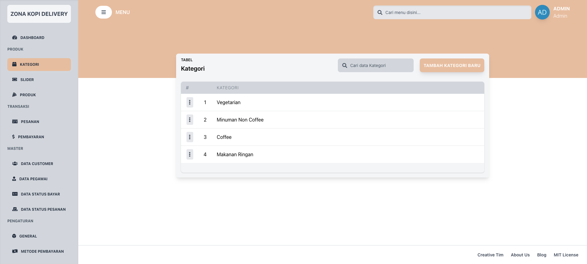
### Menambahkan kategori baru
> Jika tidak ada kategori untuk produk baru, kalian bisa menambahkan kategori baru terlebih dahulu sebelum menambahkan produk.  

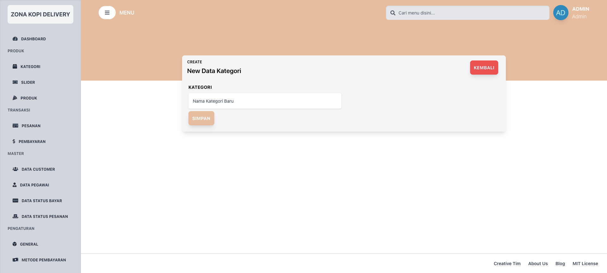
### Menghapus kategori
> Kategori yang tidak diperlukan lagi, bisa kalian hapus dengan cara menekan tombol menu, dan klik hapus.  

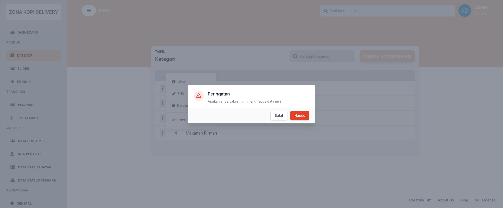
### Mengedit kategori
> Apabila terjadi kesalahan kata pada kategori yang di inputkan, kalian bisa merubahnya pada menu edit.  

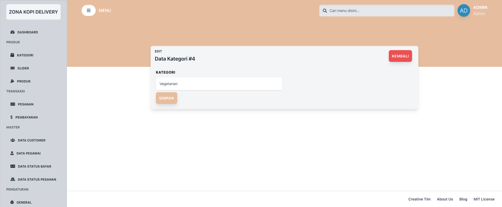
## Slider
> Slider merupakan slide yang akan tampil pada halaman utama customer. Jika kalian ingin menawarkan produk baru, bisa kalian tawarkan disana

### Menambahkan slider baru
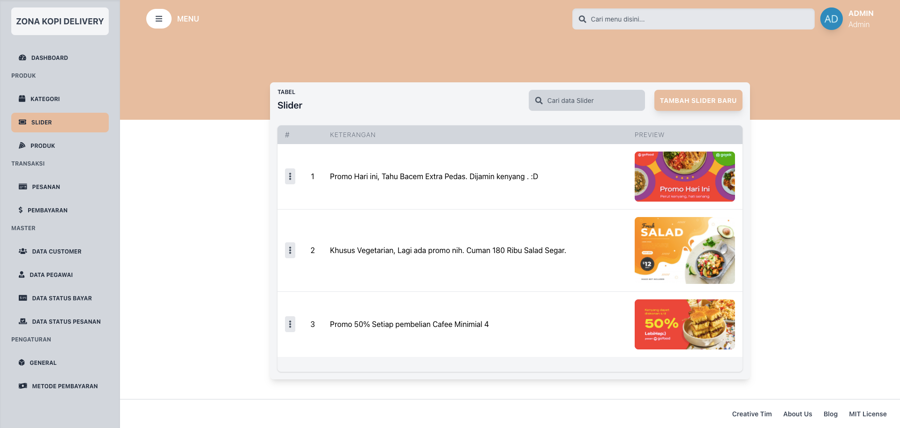
> 
### Menghapus slider

### Mengedit slider
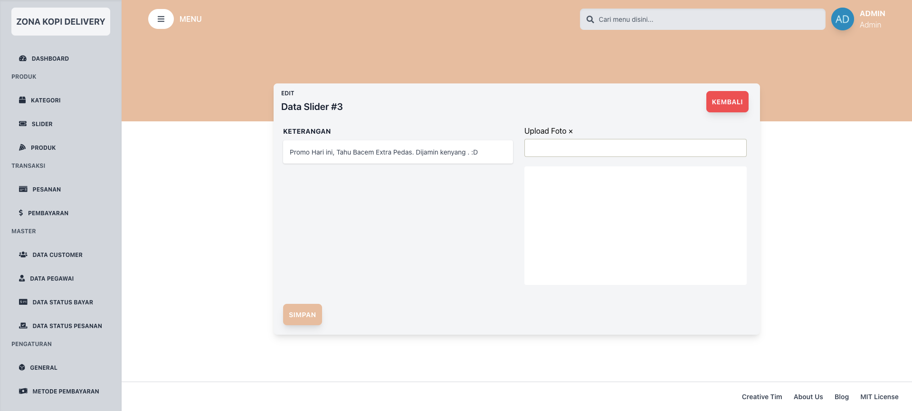
## Produk
### Data Produk
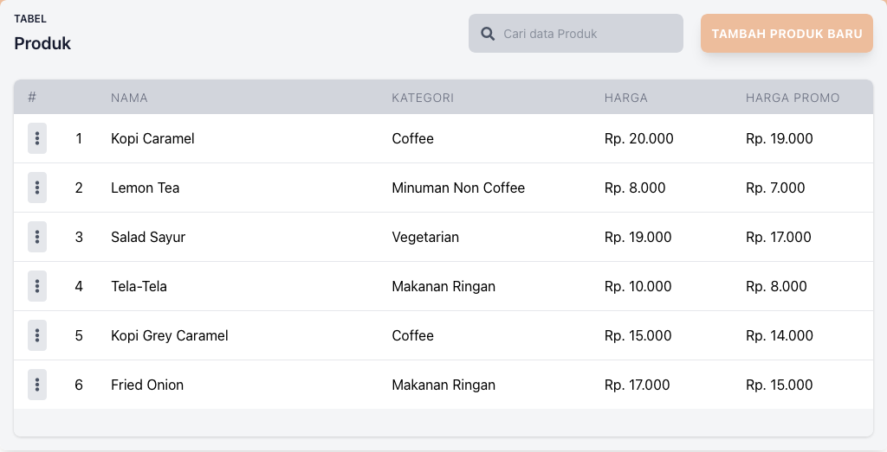
### Menambahkan produk baru
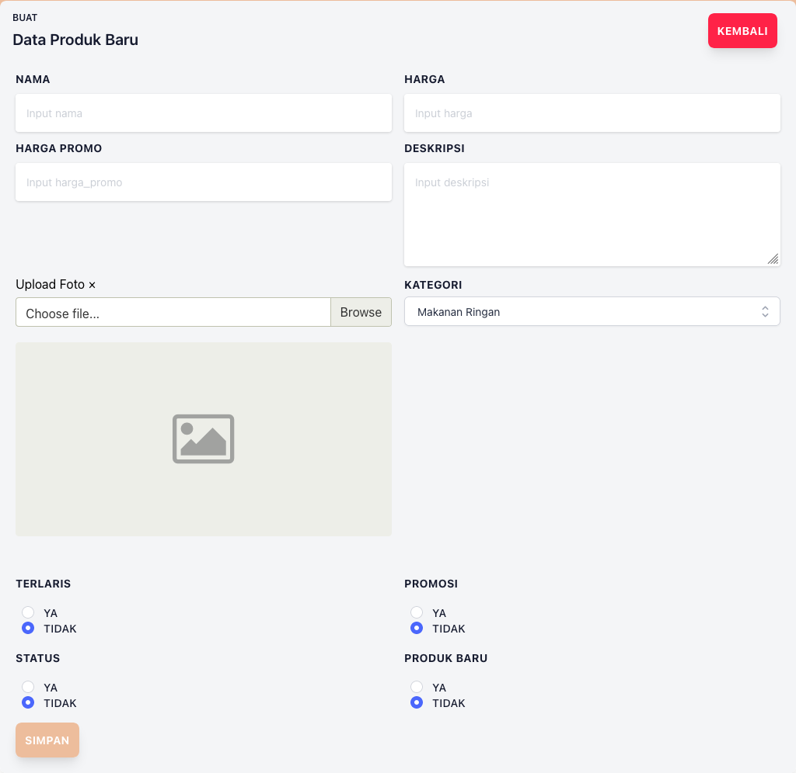
### Menghapus produk
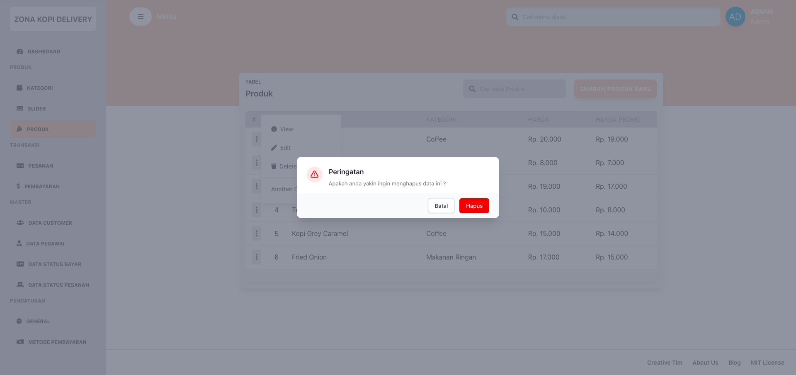
### Mengedit produk
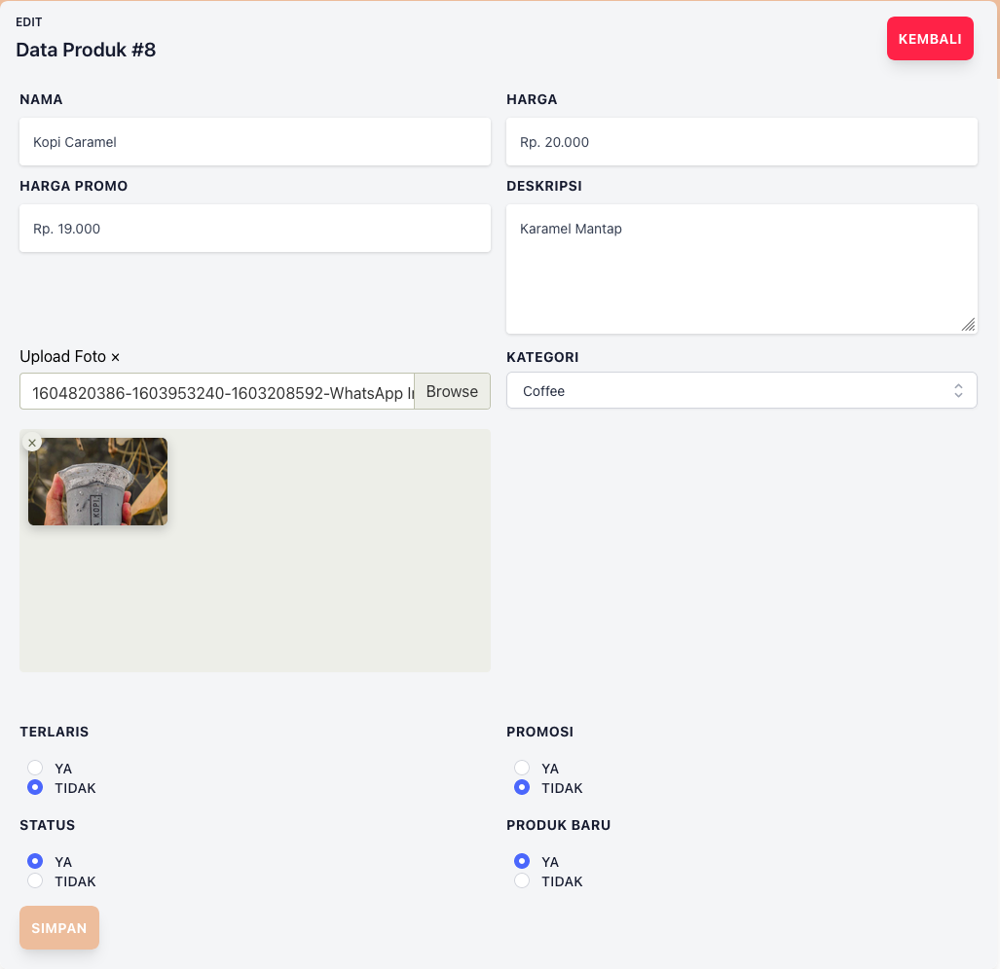
## Pesanan
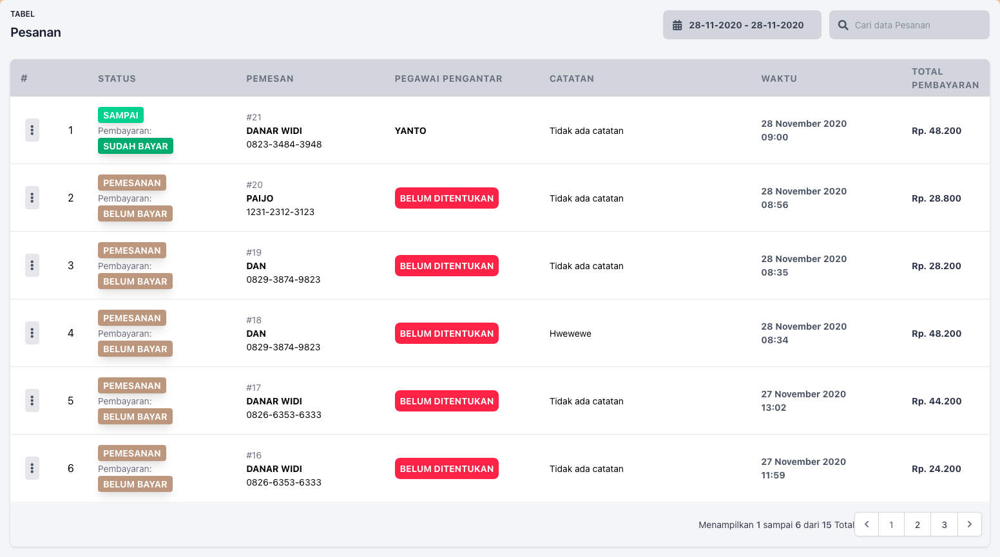
### Melihat pesanan baru
### Mengubah status pesanan
## Pembayaran
### Melihat detail pembayaran
## Data Customer
### Melihat data customer baru
### Menghapus data customer
### Mengedit data customer
## Data Pegawai
### Menambahkan data pegawai baru
### Menghapus data pegawai
### Mengedit data pegawai
### Membuat akun baru untuk pegawai
### Merubah kata sandi pegawai
## Data Status Bayar
### Disclaimer
## Data Status Pesanan
### Disclaimer

## Pengaturan Umum
### Mengubah lokasi toko melalui peta
### Merubah tipe ongkir statis dan dinamis
### Merubah data toko

## Metode Pembayaran
### Menambahkan metode pembayaran baru
### Merubah metode pembayaran
### Menghapus metode pembayaran
### Aktif dan Nonaktifkan metode pembayaran